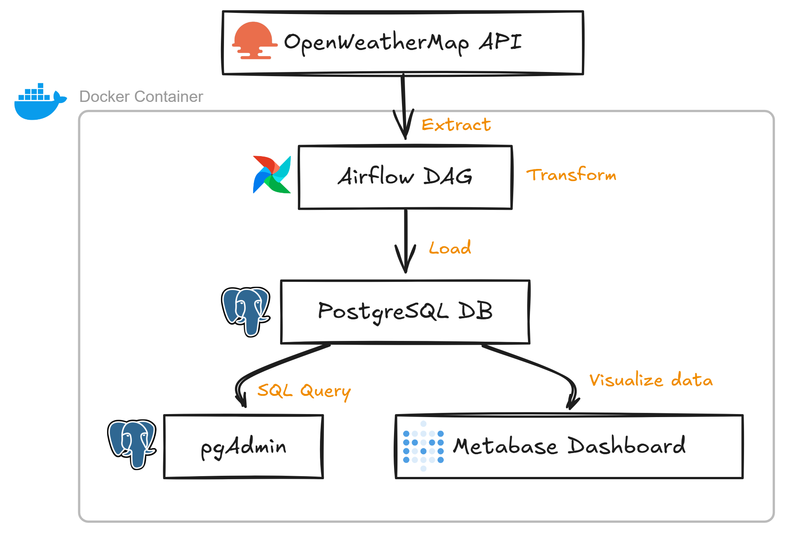

# 🌦️ ETL Weather Pipeline with Airflow

Un pipeline ETL automatisé qui collecte des données météo via l’API OpenWeather, les stocke dans une base PostgreSQL, et les visualise avec Metabase.

## 🔧 Stack technique
- **Apache Airflow** : Orchestration
- **PostgreSQL** : Stockage
- **Metabase** : Dashboard
- **pgAdmin** : Admin DB
- **Docker Compose** : Infrastructure locale
- **Dockerfile** : J'utilise un `Dockerfile` pour construire l'image d'Airflow, permettant d’ajouter des dépendances spécifiques (comme `requests`, `pandas`).


## 📊 Fonctionnalités
- Récupération automatique des données météo
- Planification quotidienne avec Airflow
- Dashboard dynamique dans Metabase
- Administration via pgAdmin

## Architecture visual 



## ▶️ Lancer le projet

```bash
git clone https://github.com/<TON_USERNAME>/etl-weather-project.git
cd etl-weather-project
cp .env.example .env  # Ajoute tes credentials et donner les villes que vous souhaitez traiter.
docker compose up --build
